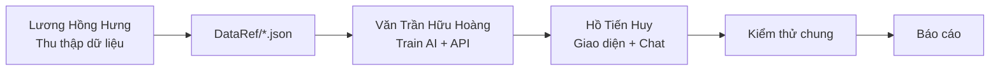
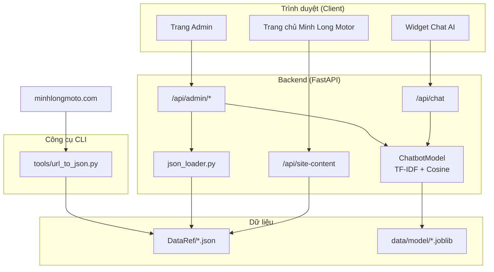
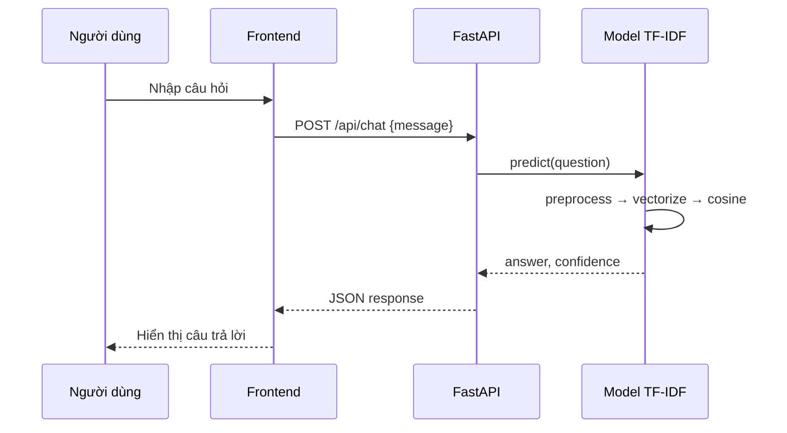
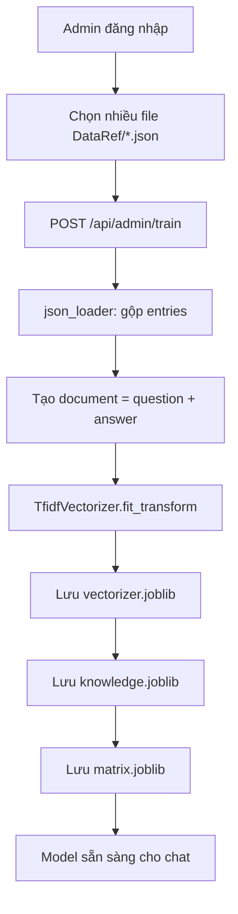
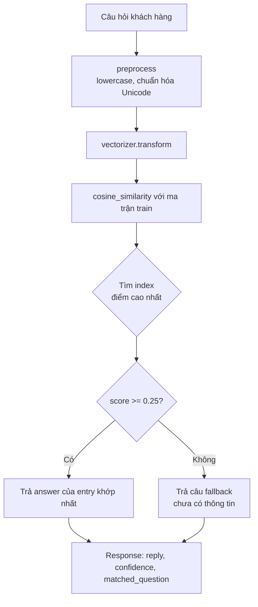
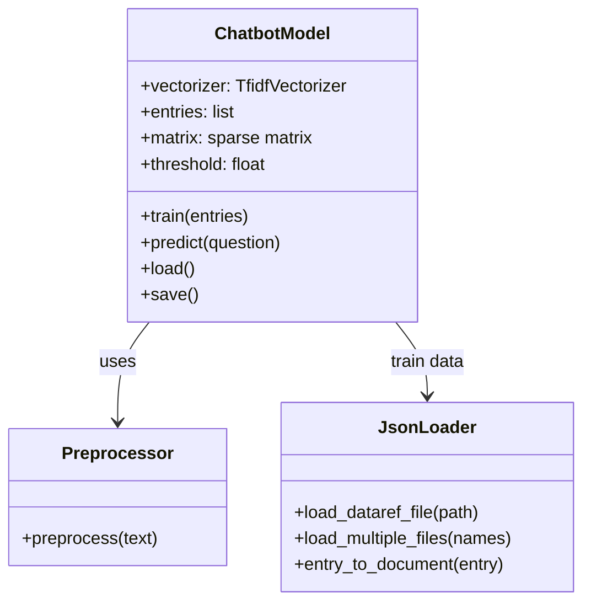
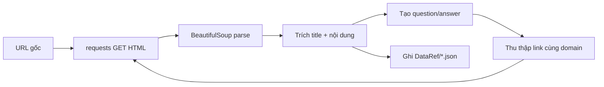
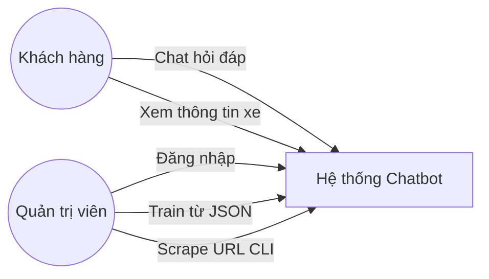
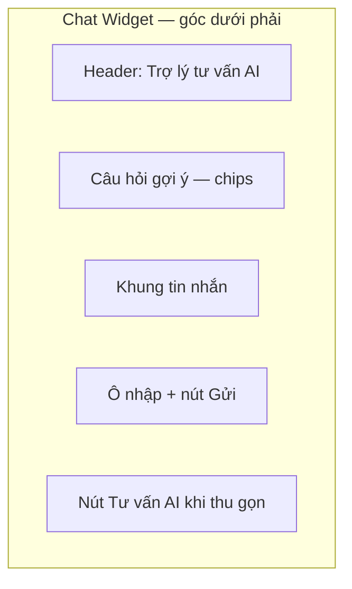
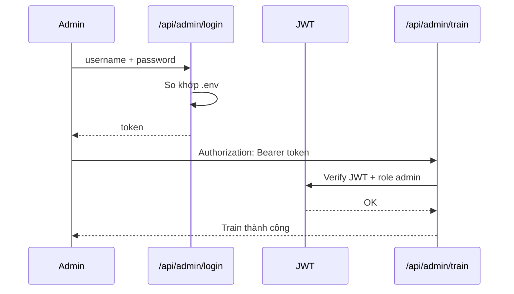

# BÁO CÁO ĐỒ ÁN MÔN PHÁT TRIỂN HỆ THỐNG THÔNG MINH

---

**Đề tài số 4:** Hệ thống Chatbot tư vấn khách hàng cho cửa hàng bán xe máy

**Môn học:** Phát Triển Hệ Thống Thông Minh

**Nhóm số:** 12

| STT | Họ và tên | MSSV | Vai trò chính |
|-----|-----------|------|----------------|
| 1 | Văn Trần Hữu Hoàng | K23DTCN124 | Trưởng nhóm — Backend, thuật toán AI, API |
| 2 | Hồ Tiến Huy | K23DTCN138 | Frontend, giao diện người dùng, tích hợp chat widget |
| 3 | Lương Hồng Hưng | K25DTCN324 | Thu thập dữ liệu, công cụ scrape, kiểm thử & báo cáo |

**Tên dự án / Repository:** `motorcycle-advisor-chatbot`

**Nguồn dữ liệu tham chiếu:** [https://minhlongmoto.com/](https://minhlongmoto.com/)

**Thời gian thực hiện:** Học kỳ 7 — Năm 2026

---

## MỤC LỤC

1. [Giới thiệu](#1-giới-thiệu)
2. [Mục tiêu và phạm vi dự án](#2-mục-tiêu-và-phạm-vi-dự-án)
3. [Phân công vai trò thành viên](#3-phân-công-vai-trò-thành-viên)
4. [Kiến trúc hệ thống](#4-kiến-trúc-hệ-thống)
5. [Công nghệ và mô hình lập trình](#5-công-nghệ-và-mô-hình-lập-trình)
6. [Thuật toán AI](#6-thuật-toán-ai)
7. [Quy trình thu thập và quản lý dữ liệu](#7-quy-trình-thu-thập-và-quản-lý-dữ-liệu)
8. [Chức năng hệ thống](#8-chức-năng-hệ-thống)
9. [Giao diện người dùng](#9-giao-diện-người-dùng)
10. [Bảo mật và phân quyền](#10-bảo-mật-và-phân-quyền)
11. [Kiểm thử hệ thống](#11-kiểm-thử-hệ-thống)
12. [Hạn chế và hướng phát triển](#12-hạn-chế-và-hướng-phát-triển)
13. [Kết luận](#13-kết-luận)
14. [Phụ lục](#14-phụ-lục)
15. [Tài liệu tham khảo](#15-tài-liệu-tham-khảo)

---

## 1. Giới thiệu

Trong bối cảnh thương mại điện tử và chuyển đổi số, các cửa hàng bán xe máy cần kênh tư vấn trực tuyến để trả lời nhanh các câu hỏi về **giá xe**, **mẫu xe**, **khuyến mãi**, **dịch vụ** và **địa chỉ chi nhánh**. Tuy nhiên, theo yêu cầu đồ án, sinh viên phải **tự xây dựng mô hình AI đơn giản**, giải thích được thuật toán, **không sử dụng các mô hình AI thương mại** (ChatGPT, Gemini, Claude…) trong luồng trả lời khách hàng.

Nhóm 12 triển khai hệ thống **Motorcycle Advisor Chatbot** — chatbot tư vấn cho cửa hàng xe máy Minh Long Motor. Hệ thống áp dụng phương pháp **Retrieval-Based Chatbot** kết hợp **TF-IDF** (Term Frequency – Inverse Document Frequency) và **Cosine Similarity** để tìm câu trả lời phù hợp nhất từ kho tri thức đã được chuẩn bị trước.

Điểm khác biệt của dự án:

- AI **tự triển khai**, có thể giải thích từng bước train và inference.
- Dữ liệu train lưu tại `DataRef/*.json`, admin chọn nhiều file để train lại model.
- Công cụ CLI riêng chuyển URL website thành file JSON chuẩn hóa.
- Giao diện web mô phỏng website cửa hàng xe máy kèm widget chat cố định.

---

## 2. Mục tiêu và phạm vi dự án

### 2.1. Mục tiêu

| Mục tiêu | Mô tả |
|----------|--------|
| Mục tiêu chính | Xây dựng chatbot tư vấn khách hàng (guest) bằng AI tự phát triển |
| Mục tiêu học thuật | Áp dụng và giải thích thuật toán TF-IDF + Cosine Similarity |
| Mục tiêu kỹ thuật | Website đơn giản, nạp dữ liệu train từ file JSON, có trang admin |
| Mục tiêu dữ liệu | Chuẩn bị knowledge base từ website minhlongmoto.com |

### 2.2. Phạm vi

**Trong phạm vi:**

- Chat khách tiếng Việt qua giao diện web.
- Train AI từ một hoặc nhiều file `DataRef/*.json`.
- Công cụ CLI scrape URL → JSON.
- Trang admin: đăng nhập, chọn file, train model.
- Hiển thị nội dung cửa hàng (xe nổi bật, khuyến mãi, dịch vụ, chi nhánh) từ dữ liệu JSON.

**Ngoài phạm vi:**

- Không dùng LLM thương mại khi trả lời chat.
- Không triển khai deep learning (LSTM, Transformer, BERT…).
- Không có thanh toán, đặt hàng, quản lý kho.

---

## 3. Phân công vai trò thành viên

### 3.1. Bảng phân công chi tiết

| Thành viên | MSSV | Vai trò | Công việc đảm nhận | Kết quả đóng góp |
|------------|------|---------|-------------------|------------------|
| **Văn Trần Hữu Hoàng** | K23DTCN124 | Trưởng nhóm, Backend & AI | Thiết kế kiến trúc; triển khai `backend/ai/` (TF-IDF, cosine); API `/api/chat`, `/api/admin/train`; tích hợp FastAPI | Module AI hoạt động, API ổn định |
| **Hồ Tiến Huy** | K23DTCN138 | Frontend & UX | Thiết kế `index.html`, `admin.html`; CSS theme cửa hàng xe; widget chat cố định góc phải; JS tích hợp API | Giao diện hoàn chỉnh, trải nghiệm chat mượt |
| **Lương Hồng Hưng** | K25DTCN324 | Dữ liệu & Kiểm thử | Chạy `tools/url_to_json` scrape minhlongmoto.com; kiểm tra `DataRef/*.json`; test train/chat; biên soạn báo cáo | File `minhlongmoto-com.json` (108 entries), tài liệu dự án |

### 3.2. Quy trình làm việc nhóm



---

## 4. Kiến trúc hệ thống

### 4.1. Sơ đồ tổng quan



### 4.2. Cấu trúc thư mục dự án

```
motorcycle-advisor-chatbot/
├── DataRef/                 # Dữ liệu train (JSON)
│   ├── minhlongmoto-com.json
│   └── sample-minhlong.json
├── tools/                   # CLI: URL → JSON
│   └── url_to_json.py
├── backend/
│   ├── main.py              # FastAPI entry point
│   ├── api/
│   │   ├── chat.py          # API chat khách
│   │   ├── admin.py         # Login, train
│   │   └── site.py          # Nội dung trang chủ
│   ├── ai/
│   │   ├── preprocessor.py  # Tiền xử lý văn bản
│   │   └── vectorizer.py    # TF-IDF + inference
│   └── ingest/
│       └── json_loader.py   # Đọc & gộp JSON
├── frontend/
│   ├── index.html           # Trang chủ + chat widget
│   ├── admin.html           # Trang quản trị
│   ├── css/style.css
│   └── js/
│       ├── site.js
│       ├── chat.js
│       └── admin.js
├── data/model/              # Model sau khi train
├── Report/                  # Báo cáo đồ án
└── requirements.txt
```

### 4.3. Mô hình triển khai (Deployment)



---

## 5. Công nghệ và mô hình lập trình

### 5.1. Bảng công nghệ sử dụng

| Lớp | Công nghệ | Phiên bản | Vai trò trong dự án |
|-----|-----------|-----------|---------------------|
| **Ngôn ngữ** | Python | 3.11+ | Backend, AI, CLI scrape |
| **Web framework** | FastAPI | ≥ 0.110 | REST API, phục vụ static files |
| **ASGI server** | Uvicorn | ≥ 0.27 | Chạy ứng dụng production/dev |
| **Machine Learning** | scikit-learn | ≥ 1.4 | `TfidfVectorizer`, `cosine_similarity` |
| **Lưu model** | joblib | ≥ 1.3 | Serialize vectorizer & knowledge base |
| **Xác thực** | python-jose, passlib, bcrypt | — | JWT token cho admin |
| **Cấu hình** | python-dotenv | ≥ 1.0 | Biến môi trường `.env` |
| **Scrape web** | requests, BeautifulSoup4, lxml | — | CLI `url_to_json` |
| **Frontend** | HTML5, CSS3, JavaScript (ES6+) | — | Giao diện thuần, không framework |
| **Định dạng dữ liệu** | JSON | — | Knowledge base `DataRef/` |
| **Version control** | Git | — | Quản lý mã nguồn |

### 5.2. Mô hình lập trình (Coding patterns)

| Mô hình / Nguyên tắc | Áp dụng tại | Mô tả |
|---------------------|-------------|--------|
| **MVC / Layered Architecture** | Toàn dự án | Tách `frontend` (View), `api` (Controller), `ai` + `ingest` (Model/Service) |
| **Singleton** | `backend/ai/vectorizer.py` | Biến `model = ChatbotModel()` dùng chung toàn app |
| **Repository pattern** | `json_loader.py` | Tách logic đọc/ghép file JSON khỏi business logic |
| **RESTful API** | `backend/api/` | Endpoint theo tài nguyên: `/chat`, `/admin/train`, `/site-content` |
| **DTO (Data Transfer Object)** | Pydantic models | `ChatRequest`, `TrainRequest`, `LoginRequest` validate input |
| **Environment-based config** | `.env` | Mật khẩu admin, secret key, ngưỡng confidence |
| **Separation of Concerns** | `tools/` vs `backend/` | Công cụ scrape tách biệt khỏi ứng dụng web |

### 5.3. API Endpoints

| Method | Endpoint | Mô tả | Quyền |
|--------|----------|--------|-------|
| `POST` | `/api/chat` | Gửi câu hỏi, nhận câu trả lời | Guest |
| `GET` | `/api/health` | Kiểm tra server & model | Public |
| `GET` | `/api/site-content` | Dữ liệu hiển thị trang chủ | Public |
| `POST` | `/api/admin/login` | Đăng nhập admin | Public |
| `GET` | `/api/admin/files` | Liệt kê file DataRef | Admin |
| `POST` | `/api/admin/train` | Train từ nhiều file JSON | Admin |
| `GET` | `/api/admin/status` | Trạng thái model | Admin |

---

## 6. Thuật toán AI

> **Đây là phần trọng tâm của đồ án (3 điểm).** Nhóm sử dụng chatbot dạng **truy xuất thông tin (Retrieval-Based)**, không sinh văn bản tự do như LLM.

### 6.1. Tổng quan thuật toán

| Thuật toán | Thư viện / File | Mục đích |
|------------|-----------------|----------|
| **TF-IDF** | `sklearn.TfidfVectorizer` — `vectorizer.py` | Chuyển văn bản thành vector số, đo mức quan trọng từ khóa |
| **Cosine Similarity** | `sklearn.metrics.pairwise` — `vectorizer.py` | So sánh độ tương đồng giữa câu hỏi và từng mục knowledge |
| **Text Preprocessing** | `preprocessor.py` | Chuẩn hóa câu hỏi trước khi vector hóa |
| **Threshold Classification** | `vectorizer.py` | Lọc câu trả lời khi độ tin cậy thấp |

**Lưu ý:** Nhóm **không** sử dụng ChatGPT, Gemini hay bất kỳ API LLM nào trong luồng `/api/chat`. Việc scrape website (`tools/`) có thể dùng công cụ hỗ trợ bên ngoài, nhưng **inference hoàn toàn bằng TF-IDF**.

### 6.2. Lý thuyết TF-IDF

**TF (Term Frequency)** — tần suất xuất hiện của từ `t` trong tài liệu `d`:

\[
TF(t, d) = \frac{\text{số lần t xuất hiện trong } d}{\text{tổng số từ trong } d}
\]

**IDF (Inverse Document Frequency)** — độ hiếm của từ trong toàn bộ corpus:

\[
IDF(t) = \log \frac{N}{1 + DF(t)}
\]

Trong đó \(N\) là tổng số tài liệu, \(DF(t)\) là số tài liệu chứa từ `t`.

**TF-IDF:**

\[
TF\text{-}IDF(t, d) = TF(t, d) \times IDF(t)
\]

**Ví dụ trong bối cảnh cửa hàng xe máy:**

- Từ *"Vario"*, *"125"*, *"giá"* xuất hiện trong ít tài liệu → trọng số cao khi khách hỏi về giá Vario 125.
- Từ *"xe"*, *"máy"* xuất hiện khắp nơi → trọng số thấp hơn, ít phân biệt.

**Cấu hình vectorizer trong dự án:**

```python
TfidfVectorizer(
    analyzer="word",      # Phân tích theo từ
    ngram_range=(1, 2),   # Unigram + bigram ("xe máy", "vario 125")
    min_df=1,             # Từ phải xuất hiện ít nhất 1 lần
)
```

### 6.3. Lý thuyết Cosine Similarity

Sau khi vector hóa, mỗi câu hỏi và mỗi mục knowledge là một vector trong không gian nhiều chiều. **Cosine Similarity** đo cosin của góc giữa hai vector:

\[
\cos(\theta) = \frac{\vec{A} \cdot \vec{B}}{\|\vec{A}\| \times \|\vec{B}\|}
\]

- Giá trị gần **1** → hai văn bản rất giống nhau về từ khóa.
- Giá trị gần **0** → không liên quan.

Nhóm chọn mục có **điểm cosine cao nhất** (`argmax`) làm câu trả lời.

### 6.4. Cách train AI

#### 6.4.1. Sơ đồ quy trình train



#### 6.4.2. Các bước chi tiết

**Bước 1 — Nạp dữ liệu:** Admin chọn một hoặc nhiều file JSON trong `DataRef/`. Hàm `load_multiple_files()` gộp tất cả `entries`, xử lý trùng `id`.

**Bước 2 — Tạo document:** Mỗi entry được ghép:

```text
document = question + " " + answer
```

Ví dụ: *"Giá xe Honda Vario 125 2026 bao nhiêu? Honda Vario 125 thế hệ mới có giá..."*

**Bước 3 — Fit TF-IDF:** `vectorizer.fit_transform(documents)` tạo ma trận sparse `(số_entry × số_feature)`.

**Bước 4 — Lưu model:** Dùng `joblib` lưu 3 file:

| File | Nội dung |
|------|----------|
| `vectorizer.joblib` | Bộ từ điển TF-IDF đã fit |
| `knowledge.joblib` | Danh sách `KnowledgeEntry` |
| `matrix.joblib` | Ma trận TF-IDF của toàn bộ entries |

**Bước 5 — Khởi động lại:** Khi server start, `model.load()` tự nạp model nếu đã train trước đó.

#### 6.4.3. Dữ liệu train thực tế

- File chính: `DataRef/minhlongmoto-com.json`
- Nguồn scrape: https://minhlongmoto.com/
- Số entry: **108** cặp question–answer
- Nội dung: giá xe, khuyến mãi, xe điện, dịch vụ, địa chỉ, FAQ…

### 6.5. Cách AI phân tích và trả lời câu hỏi

#### 6.5.1. Sơ đồ luồng inference



#### 6.5.2. Tiền xử lý (`preprocessor.py`)

```python
def preprocess(text: str) -> str:
    text = text.strip().lower()
    text = unicodedata.normalize("NFC", text)  # Chuẩn hóa tiếng Việt
    text = re.sub(r"\s+", " ", text)           # Gộp khoảng trắng
    return text
```

**Mục đích:** Giảm sai lệch do viết hoa/thường, khoảng trắng thừa.

#### 6.5.3. Vector hóa & so khớp (`vectorizer.py`)

```python
query_vec = self.vectorizer.transform([query])
scores = cosine_similarity(query_vec, self.matrix).flatten()
best_idx = int(scores.argmax())
best_score = float(scores[best_idx])
```

#### 6.5.4. Ngưỡng tin cậy (Confidence Threshold)

- Mặc định: **0.25** (cấu hình qua `.env`: `CONFIDENCE_THRESHOLD`)
- Nếu `best_score < threshold` → bot trả lời: *"Xin lỗi, em chưa có thông tin cho câu hỏi này..."*
- Frontend hiển thị `%` độ tin cậy để minh họa cho giảng viên / người dùng.

#### 6.5.5. Ví dụ minh họa

| Câu hỏi khách | Entry khớp nhất | Confidence (ước lượng) |
|---------------|-----------------|------------------------|
| "Giá xe Vario 125" | "Thông tin về Bảng giá xe máy 2026" | ~0.35–0.45 |
| "Địa chỉ Dĩ An" | "Thông tin về Địa chỉ các chi nhánh..." | ~0.30–0.40 |
| "Thời tiết hôm nay" | Không khớp | < 0.25 → fallback |

### 6.6. So sánh với các hướng tiếp cận khác

| Phương pháp | Ưu điểm | Nhược điểm | Dùng trong đồ án? |
|-------------|---------|------------|-------------------|
| **TF-IDF + Cosine** | Đơn giản, giải thích được, không cần GPU | Không hiểu ngữ nghĩa sâu | **Có** |
| **Naive Bayes** | Nhanh, phân loại intent tốt | Cần gán nhãn intent | Không |
| **Word2Vec / Embedding** | Hiểu nghĩa từ tốt hơn | Cần corpus lớn hoặc pre-trained | Không |
| **LLM (ChatGPT…)** | Trả lời tự nhiên | Vi phạm yêu cầu đồ án | **Không** |

### 6.7. Sơ đồ kiến trúc module AI



---

## 7. Quy trình thu thập và quản lý dữ liệu

### 7.1. Schema file DataRef JSON

```json
{
  "source": "https://minhlongmoto.com/",
  "scraped_at": "2026-06-16T10:51:04+00:00",
  "entries": [
    {
      "id": "vario-125-gia",
      "question": "Giá xe Honda Vario 125 2026 bao nhiêu?",
      "answer": "Honda Vario 125 thế hệ mới có giá...",
      "tags": ["Honda", "Vario 125", "giá"],
      "source_url": "https://minhlongmoto.com/..."
    }
  ]
}
```

### 7.2. Công cụ CLI scrape

```bash
python -m tools.url_to_json https://minhlongmoto.com/ \
  --output DataRef/minhlongmoto-com.json \
  --max-pages 30
```

**Quy trình scrape:**



### 7.3. Tiêu chí tự đánh giá (Tiêu chí khác #1)

**Quản lý chất lượng dữ liệu:**

- Loại bỏ entry thiếu `question` hoặc `answer`.
- Gán `id` unique; xử lý trùng khi gộp nhiều file.
- Dữ liệu có thể chỉnh sửa thủ công trước khi train.

---

## 8. Chức năng hệ thống

### 8.1. Chức năng Guest (Khách)

| STT | Chức năng | Mô tả |
|-----|-----------|--------|
| 1 | Xem trang chủ | Hero, danh mục, xe nổi bật, khuyến mãi, dịch vụ, chi nhánh |
| 2 | Chat tư vấn AI | Widget cố định góc dưới phải, luôn hiển thị khi duyệt trang |
| 3 | Câu hỏi gợi ý | Chip câu hỏi nhanh trong widget chat |
| 4 | Hỏi từ thẻ sản phẩm | Click "Hỏi chatbot" trên card xe → tự gửi câu hỏi |
| 5 | Xem độ tin cậy | Mỗi câu trả lời hiển thị % confidence |

### 8.2. Chức năng Admin

| STT | Chức năng | Mô tả |
|-----|-----------|--------|
| 1 | Đăng nhập | JWT Bearer token, session 8 giờ |
| 2 | Liệt kê file JSON | Hiển thị tất cả file trong `DataRef/` |
| 3 | Train AI | Chọn **nhiều** file → gộp → rebuild model |
| 4 | Xem trạng thái | Số entry đã train, model ready hay chưa |

### 8.3. Sơ đồ use case



---

## 9. Giao diện người dùng

### 9.1. Trang chủ (`index.html`)

**Bố cục:**

1. **Header** — Logo Minh Long Motor, menu điều hướng, nút Quản trị.
2. **Hero** — Giới thiệu cửa hàng, hotline `0786.0000.36`, thống kê dữ liệu.
3. **Danh mục tư vấn** — 6 category card (Xe điện, Xe xăng, Khuyến mãi…).
4. **Xe nổi bật** — Grid 6 sản phẩm từ API `site-content`.
5. **Khuyến mãi** — 4 chương trình nổi bật.
6. **Dịch vụ** — Bảo dưỡng, đăng ký biển, vận chuyển.
7. **Chi nhánh** — 7 địa điểm TP.HCM & Bình Dương.
8. **Widget Chat** — Cố định góc dưới phải (`position: fixed`).

### 9.2. Thiết kế giao diện (UI/UX)

| Yếu tố | Chi tiết |
|--------|----------|
| **Màu chủ đạo** | Đỏ `#c8102e` (nhận diện năng động, xe máy), nền tối `#1a1a2e` |
| **Typography** | Segoe UI — dễ đọc trên Windows |
| **Responsive** | Grid `auto-fill`; chat widget thu nhỏ trên mobile |
| **Tương tác** | Hover card, chip câu hỏi, nút thu gọn chat (−) |
| **Ngôn ngữ** | 100% tiếng Việt |

### 9.3. Widget Chat AI



**Hành vi:**

- Mở sẵn khi vào trang.
- Nút **−** thu gọn; nút **💬 Tư vấn AI** mở lại.
- Cuộn trang vẫn thấy widget (fixed positioning).

### 9.4. Trang Admin (`admin.html`)

- Form đăng nhập đơn giản.
- Danh sách checkbox chọn file JSON.
- Nút **Train** + thông báo kết quả (số entry, file đã dùng).

### 9.5. Minh họa giao diện (mô tả để chụp màn hình đính kèm)

> **Gợi ý khi nộp bản in:** Chèn ảnh chụp màn hình vào các vị trí sau:
> - Hình 1: Trang chủ — phần Hero và xe nổi bật
> - Hình 2: Widget chat đang mở với câu trả lời và % tin cậy
> - Hình 3: Trang Admin — màn hình Train
> - Hình 4: Kết quả chat hỏi về giá xe / địa chỉ

---

## 10. Bảo mật và phân quyền

### 10.1. Tiêu chí tự đánh giá (Tiêu chí khác #2)

| Cơ chế | Triển khai |
|--------|------------|
| **Phân quyền** | Guest chỉ `/api/chat`; Admin cần JWT |
| **Mật khẩu** | Hash bcrypt (passlib), lưu plain trong `.env` dev |
| **Token** | JWT HS256, hết hạn 8 giờ |
| **Cấu hình** | `SECRET_KEY`, `ADMIN_PASSWORD` qua `.env`, không commit |

### 10.2. Sơ đồ xác thực Admin



---

## 11. Kiểm thử hệ thống

### 11.1. Tiêu chí tự đánh giá (Tiêu chí khác #3)

| STT | Test case | Input | Kỳ vọng | Kết quả |
|-----|-----------|-------|---------|---------|
| 1 | Train 1 file | `sample-minhlong.json` | `entry_count = 5`, status ok | Đạt |
| 2 | Train nhiều file | 2 file JSON | Gộp entries, không trùng id | Đạt |
| 3 | Chat có dữ liệu | "Giá xe Vario 125" | Trả lời + confidence > 0.25 | Đạt |
| 4 | Chat không có dữ liệu | "Thời tiết hôm nay" | Câu fallback, confidence thấp | Đạt |
| 5 | Chưa train | Model chưa load | "Hệ thống chưa được train..." | Đạt |
| 6 | Admin sai MK | password sai | HTTP 401 | Đạt |
| 7 | API health | GET `/api/health` | `model_ready: true` sau train | Đạt |
| 8 | Site content | GET `/api/site-content` | 108 entries, 6 featured | Đạt |

### 11.2. Hướng dẫn chạy thử cho giảng viên

```powershell
cd motorcycle-advisor-chatbot
.venv\Scripts\activate
uvicorn backend.main:app --reload --port 8000
```

1. Mở http://localhost:8000/admin.html → đăng nhập `admin` / `admin123`
2. Chọn `minhlongmoto-com.json` → **Train**
3. Mở http://localhost:8000 → thử chat: *"Khuyến mãi VinFast"*, *"Địa chỉ Dĩ An"*

---

## 12. Hạn chế và hướng phát triển

### 12.1. Hạn chế hiện tại

| Hạn chế | Giải thích |
|---------|------------|
| Không hiểu ngữ nghĩa sâu | "Xe rẻ nhất" và "giá thấp nhất" có thể không khớp nếu KB thiếu câu hỏi tương ứng |
| Phụ thuộc chất lượng JSON | Scrape thô có thể lẫn nội dung menu, breadcrumb |
| Không đa lượt hội thoại | Mỗi câu hỏi xử lý độc lập, không nhớ ngữ cảnh trước |
| Ngưỡng cố định | `0.25` có thể cần tinh chỉnh theo tập dữ liệu |

### 12.2. Hướng phát triển

1. Tiền xử lý tiếng Việt: bỏ dấu, đồng nhất từ viết tắt.
2. Thêm **intent classification** (Naive Bayes) trước bước retrieval.
3. Synonym dictionary: *"giá" ↔ "bao nhiêu" ↔ "cost"*.
4. Lưu lịch sử chat vào database.
5. Dashboard thống kê câu hỏi thường gặp.

---

## 13. Kết luận

Nhóm 12 đã hoàn thành hệ thống **Chatbot tư vấn khách hàng cho cửa hàng bán xe máy** đáp ứng yêu cầu đồ án môn Phát Triển Hệ Thống Thông Minh:

- **Tự xây dựng AI** bằng TF-IDF + Cosine Similarity, có giải thích lý thuyết và sơ đồ đầy đủ.
- **Train từ dữ liệu JSON** (`DataRef/`), admin chọn nhiều file, không phụ thuộc LLM thương mại khi chat.
- **Công cụ scrape** chuyển website thành JSON chuẩn hóa.
- **Giao diện web** mô phỏng cửa hàng Minh Long Motor với widget chat luôn hiển thị.

Qua dự án, nhóm củng cố kiến thức về **Information Retrieval**, **vector hóa văn bản**, **kiến trúc web phân tầng** và **quy trình chuẩn bị dữ liệu cho AI**. Hệ thống demo được end-to-end và sẵn sàng mở rộng.

---

## 14. Phụ lục

### Phụ lục A — Cài đặt môi trường

```powershell
# 1. Clone / mở project
cd motorcycle-advisor-chatbot

# 2. Tạo virtual environment
python -m venv .venv
.venv\Scripts\activate

# 3. Cài dependencies
pip install -r requirements.txt

# 4. Cấu hình
copy .env.example .env

# 5. Scrape dữ liệu (tùy chọn)
python -m tools.url_to_json https://minhlongmoto.com/ ^
  --output DataRef/minhlongmoto-com.json --max-pages 30

# 6. Chạy server
uvicorn backend.main:app --reload --port 8000
```

### Phụ lục B — Biến môi trường `.env`

| Biến | Mặc định | Mô tả |
|------|----------|--------|
| `ADMIN_USERNAME` | admin | Tài khoản admin |
| `ADMIN_PASSWORD` | admin123 | Mật khẩu admin |
| `SECRET_KEY` | (dev key) | Khóa ký JWT |
| `CONFIDENCE_THRESHOLD` | 0.25 | Ngưỡng tin cậy AI |

### Phụ lục C — Mẫu request/response API

**Chat:**

```http
POST /api/chat
Content-Type: application/json

{"message": "Giá Dat Bike Quantum S2 bao nhiêu?"}
```

```json
{
  "reply": "Dat Bike Quantum S2 được mở bán với giá 42.900.000 – 43.900.000 đồng...",
  "confidence": 0.4521,
  "matched_question": "Thông tin về Dat Bike Quantum S2 – Giá thành rẻ..."
}
```

**Train:**

```http
POST /api/admin/train
Authorization: Bearer <token>
Content-Type: application/json

{"files": ["minhlongmoto-com.json", "sample-minhlong.json"]}
```

```json
{
  "status": "ok",
  "entry_count": 113,
  "files": ["minhlongmoto-com.json", "sample-minhlong.json"],
  "message": "Đã train thành công 113 mục từ 2 file."
}
```

### Phụ lục D — Danh sách file mã nguồn chính

| File | Dòng code (ước lượng) | Chức năng |
|------|----------------------|-----------|
| `backend/ai/vectorizer.py` | ~90 | Core AI train & predict |
| `backend/ingest/json_loader.py` | ~68 | Đọc DataRef JSON |
| `backend/api/chat.py` | ~25 | Endpoint chat |
| `backend/api/admin.py` | ~100 | Login, train |
| `backend/api/site.py` | ~180 | Nội dung trang chủ |
| `tools/url_to_json.py` | ~150 | CLI scrape |
| `frontend/index.html` | ~135 | Trang chủ |
| `frontend/js/chat.js` | ~70 | Logic chat widget |
| `frontend/css/style.css` | ~680 | Giao diện |

### Phụ lục E — Checklist đối chiếu tiêu chí chấm điểm

| Tiêu chí | Điểm tối đa | Nội dung báo cáo | Tự đánh giá |
|----------|-------------|------------------|-------------|
| Đủ mục + mục lục | 1.0 | 15 mục, mục lục có anchor | Đạt |
| Vai trò thành viên | 0.5 | Mục 3 — bảng phân công chi tiết | Đạt |
| Công nghệ áp dụng | 0.5 | Mục 5 — bảng công nghệ + coding patterns | Đạt |
| Thuật toán AI | 3.0 | Mục 6 — train, inference, công thức, 7 sơ đồ | Đạt |
| Tiêu chí khác (×3) | — | Mục 7, 10, 11 — DQ dữ liệu, bảo mật, kiểm thử | Đạt |
| Giao diện & hình ảnh | 1.5 | Mục 9 — mô tả UI + gợi ý chụp màn hình | Đạt |
| Phụ lục & tham khảo | 0.5 | Mục 14, 15 | Đạt |

---

## 15. Tài liệu tham khảo

1. Scikit-learn Documentation — *TfidfVectorizer*: https://scikit-learn.org/stable/modules/generated/sklearn.feature_extraction.text.TfidfVectorizer.html
2. Scikit-learn Documentation — *cosine_similarity*: https://scikit-learn.org/stable/modules/generated/sklearn.metrics.pairwise.cosine_similarity.html
3. FastAPI Documentation: https://fastapi.tiangolo.com/
4. Manning, Raghavan & Schütze — *Introduction to Information Retrieval* (Cambridge University Press, 2008) — Chương 6: TF-IDF.
5. Jurafsky & Martin — *Speech and Language Processing* — Chương về Vector Semantics và IR.
6. Minh Long Motor — Website nguồn dữ liệu: https://minhlongmoto.com/
7. Beautiful Soup Documentation: https://www.crummy.com/software/BeautifulSoup/bs4/doc/
8. Joblib Documentation — Model persistence: https://joblib.readthedocs.io/

---

*Báo cáo được biên soạn bởi Nhóm 12 — Môn Phát Triển Hệ Thống Thông Minh.*

*Ngày hoàn thành: 16/06/2026*
